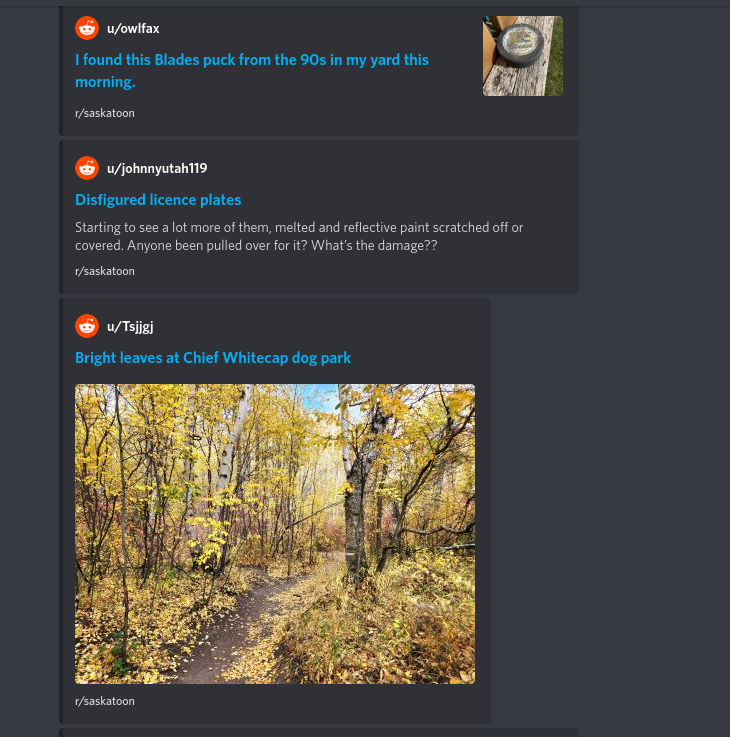

# 🍔 🍔 Funbunn 🍔 🍔

Polls for new subreddit posts using `https://reddit.com/r/new/<subreddit>.json` and forwards it to a webhook (Currently supports Discord)

To run

1. grab the `build.zip` from the [latest release](https://github.com/fmterrorf/funbunn/releases) and unzip it
2. Quickest way to get started is to run 

        WEBHOOK_ROUTE_CONFIG_PATH="<absolute path to config>.json" ./bin/poll


## Environment variables

* `WEBHOOK_ROUTE_CONFIG_PATH` - absolute path of the config file
* `WEBHOOK_ROUTE_CONFIG_BASE64` - base64 representation of the config contents. Useful if you want to store the config file in secret env var


## Config example

config.json
```json
[
  {
    "webhook": "https://discord.com/webhook",
    "subreddit": "saskatoon"
  },
  {
    "webhook": "https://discord.com/webhook",
    "subreddit": "saskatchewan"
  }
]
```


Example message 


